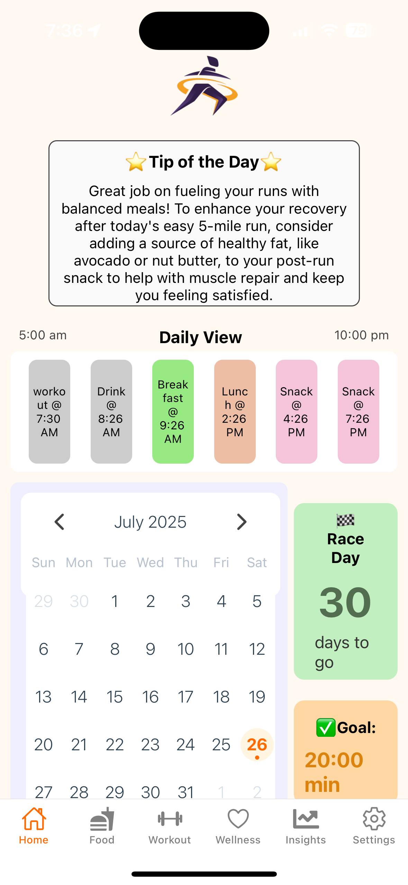
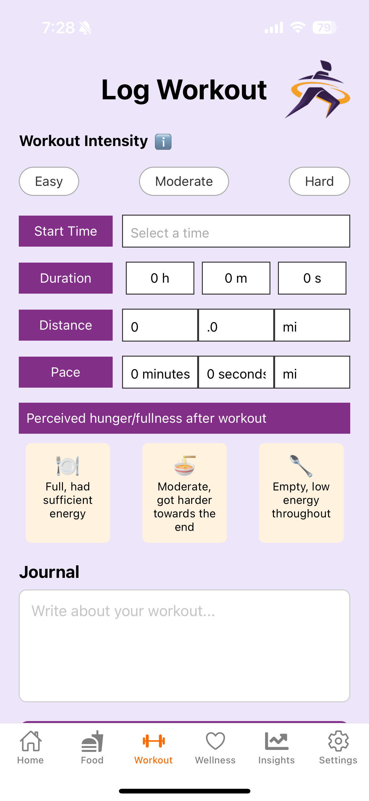
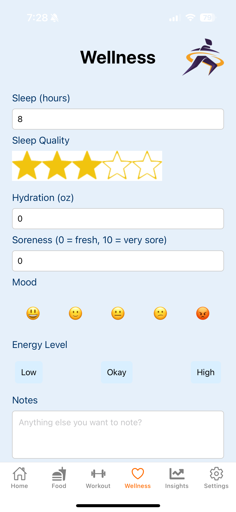
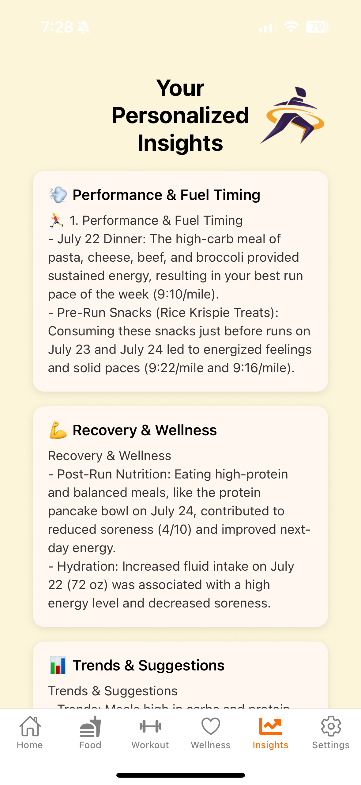

# 🏃‍♀️ Fuel My Stride

**Fuel My Stride** is a nutrition and recovery app designed specifically for runners. It helps you fuel smarter with personalized insights, portion-based logging (no calorie counting), and training-based recommendations.

> 🚨 **Currently in MVP — we’re looking for testers!**  
> Want to try it out and help shape the final product? [Sign up to test the app here.](https://forms.gle/VbxA35AHu8Z4MchW9)

---

## 📱 Key Features

- ✅ Built for runners — not dieters
- 🍽️ Log meals using portion-based categories
- 🏋️ Track workouts, pace, and intensity
- 💡 Get weekly insights from your logs to improve performance
- 💧 Wellness tracking (sleep, hydration, soreness, mood, etc.)
- 📊 Daily fuel goals tailored to your training load

---

## 🚀 Getting Started (for Testers)

### Prerequisites
- A smartphone
- A willingness to give feedback 🙂

### How to Try It
1. Request access through our [tester form](https://forms.gle/8A32nNdqBwJXaMCE6)
2. We’ll email you instructions
3. Use the app for a few days — log meals, workouts, and wellness
4. Submit feedback via a short form (we’ll send the link)

---

## 🧪 Built With

- **React Native** (via Expo)
- **AsyncStorage** for on-device data
- **OpenAI** for weekly insight generation
- **Claude** for safety checks on insights
- **Custom nutrition logic** for portion guidance and fuel goals

---

## 📸 Screenshots

---

## 🙋‍♀️ About the Creator

Hi! I'm **Summer**, a runner and creator passionate about helping athletes avoid underfueling and burnout.  
**Fuel My Stride** was built to make logging fast, fuel guidance simple, and insights actionable.

---

## 💬 Feedback & Contact

If you're testing the app or have ideas:
- Fill out our [tester feedback form](https://forms.gle/8A32nNdqBwJXaMCE6)  
- Email: summer.fuelmystride@gmail.com  
- Follow updates on Instagram @fuelmystride

---

> _Thank you for helping bring this to life — every bit of feedback helps!_
